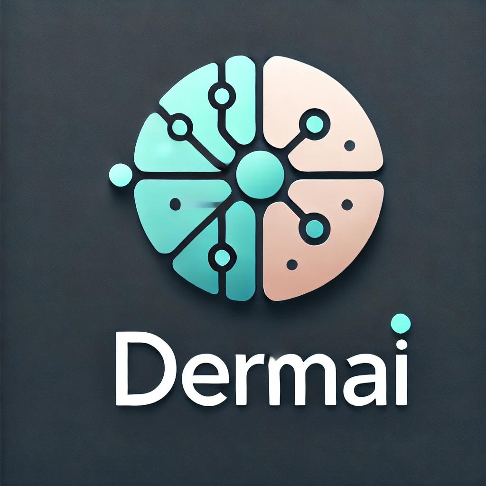

<!-- PROJECT LOGO -->
<br />
<p align="center">
  <a href="https://github.com/Vivek-Hiremath55/AI_Systems_Pro">
    
  </a>

  <h3 align="center">DermAI: AI Model for Early Skin Cancer Detection</h3>

  <p align="center">
    An AI-driven solution aimed at supporting early detection of skin cancer using low-quality images captured with smartphones.
    <br />
    <a href="https://github.com/Vivek-Hiremath55/AI_Systems_Pro/blob/main/README.md"><strong>Explore the docs »</strong></a>
    <br />
    <br />
    <a href="#usage">View Demo</a>
    ·
    <a href="https://github.com/Vivek-Hiremath55/AI_Systems_Pro/issues">Report Bug</a>
    ·
    <a href="https://github.com/Vivek-Hiremath55/AI_Systems_Pro/issues">Request Feature</a>
  </p>
</p>

<!-- TABLE OF CONTENTS -->
<details open="open">
  <summary>Table of Contents</summary>
  <ol>
    <li>
      <a href="#about-the-project">About The Project</a>
      <ul>
        <li><a href="#built-with">Built With</a></li>
      </ul>
    </li>
    <li>
      <a href="#getting-started">Getting Started</a>
      <ul>
        <li><a href="#dependencies">Dependencies</a></li>
        <li><a href="#installation">Installation</a></li>
      </ul>
    </li>
    <li><a href="#usage">Usage</a></li>
    <li><a href="#roadmap">Roadmap</a></li>
    <li><a href="#contributing">Contributing</a></li>
    <li><a href="#license">License</a></li>
    <li><a href="#authors">Authors</a></li>
    <li><a href="#acknowledgements">Acknowledgements</a></li>
  </ol>
</details>

<!-- ABOUT THE PROJECT -->
## About The Project

DermAI is an AI-driven solution aimed at supporting early detection of skin cancer using low-quality images captured with smartphones. The tool is designed to assist underserved populations with limited access to specialized dermatological care. By analyzing images and descriptions, DermAI can classify skin lesions as benign or malignant and provide insights to help triage patients who may need in-person consultations with dermatologists.

## One Stop Link

Link for dataset, pretrained models and images [One Stop Link](https://drive.google.com/drive/folders/1cU5J57u6s7rb_7-Lv3lTnTtOjbZXfy1f)

### Built With

* [Python](https://www.python.org/)
* [TensorFlow](https://www.tensorflow.org/)
* [Keras](https://keras.io/)
* [OpenCV](https://opencv.org/)

## Repository File Structure

Below is the file structure of the `DermAI` repository:

```plaintext
AI_Systems_Pro/
├── deployment/                          # Docker Files
│   ├── Dockerfile          
│   ├── docker-compose.yml
├── documentation/                       # Articulation of DermAI
│   ├── AIS Project Template
│   ├── DermAI_logo.jpg
│   ├── Readme.md
├── monitoring/                          # Monitoring files
│   ├── prometheus.yml
├── src/                                 # Pre-trained and custom models
│   ├── data/
│   │   ├── data.md                      # Link to Google Drive containing datset
│   ├── models/
|   │   ├── model.md                     # Link to Google Drive containing pre-trained models
│   ├── requirements.txt
│   ├── Data_Classifier_Model.ipynb      # Model Building for Data based model
│   ├── Image_classifier_model.ipynb     # Model Building for Image based Classifier
│   ├── Inference_Notebook.ipynb         # Model Building for Combined based classifier
│   ├── ui_notebook.py                   # Entry point script
├── videos/
│   ├── demo_video
```

<!-- GETTING STARTED -->
## Getting Started

To get a local copy up and running, follow these steps.

### Dependencies

* Python 3.8
* TensorFlow 2.5.0
  ```sh
  pip install tensorflow==2.5.0
* Keras 2.4.3
  ```sh
  pip install keras==2.4.3
* OpenCV 4.5.2
  ```sh
  pip install opencv-python==4.5.2
  
## Installation

This project is designed to be executed in **Google Colab**, which provides an easy-to-use environment with all the necessary packages pre-installed.

### Steps to Get Started on Google Colab

#### Running in Google Colab:
1. **Clone the Repository**  
   Open a new notebook in Google Colab and run the following command to clone the repository:  
   ```sh
   !git clone https://github.com/Vivek-Hiremath55/AI_Systems_Pro.git

Make sure that the required libraries are installed (which is the default case). However, if there is a version mismatch, refer dependencies to figure out the correct versions and update them in the session.

#### Running on local setup
1. **Clone the Repository**
2. **Make sure your environment has the dependencies installed**
3. **Make changes to paths / environment variables in `ui_notebook.py`**
4. **Run the notebook**

#### Deploying the project
1. **Clone repository**
2. **Make sure your environment has the dependencies installed**
3. **Make changes to paths / environment variables in `ui_notebook.py`**
4. **Build and run the docker container with the files from deployment**
   
<!-- USAGE EXAMPLES -->
## Usage
To use DermAI, follow these steps:

* Load the `ui_notebook.py` notebook. 
* Modify the paths to `pre-trained models` wherever necessary.
* Run the `ui_notebook.py` script in Colab with the paths to the uploaded files as arguments.
* Upload the image of affected area & fill up the requested information.

<!-- ROADMAP-->
## Roadmap
See the [open issues](https://github.com/Vivek-Hiremath55/AI_Systems_Pro/issues) for a list of proposed features (and known issues).

<!--CONTRIBUTING-->
## Contributing
Contributions are what make the open source community such an amazing place to learn, inspire, and create. Any contributions you make are greatly appreciated.

* Fork the Project
* Create your Feature Branch (`git checkout -b feature/AmazingFeature`)
* Commit your Changes (`git commit -m 'Add some AmazingFeature'`)
* Push to the Branch (`git push origin feature/AmazingFeature`)
* Open a Pull Request

<!--LICENSE-->
## License
No license requirements

<!-- AUTHORS -->
## Authors
* Nikhil Reddy
* Vivek Hiremath

<!--ACKNOWLEDGEMENT-->
## Acknowledgements
* Prof. Andrea Ramirez


